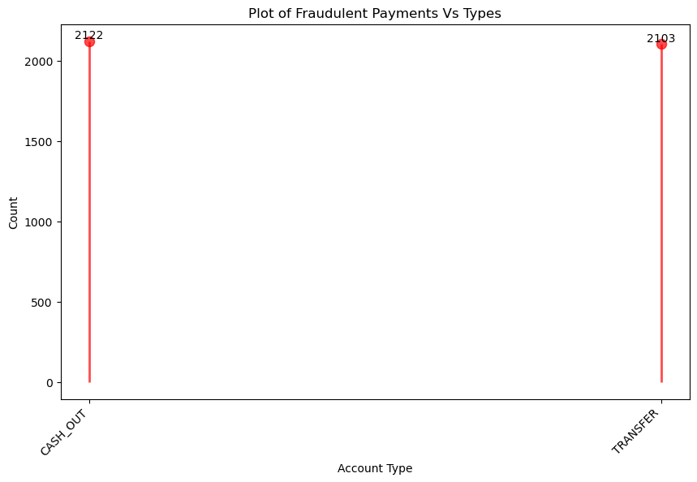
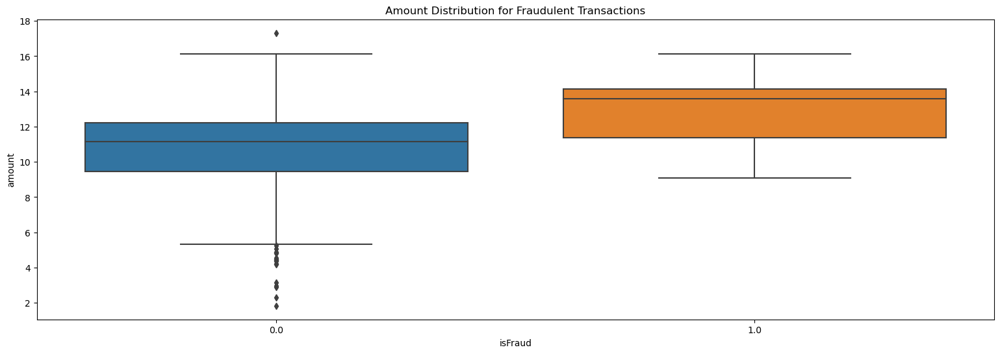

# :money_with_wings: Fraud Detection :exclamation:

This is a project based on historical transactions data from a bank. This will allow the creation of a minimal-viable-product that detects fraudulant payments.

Currently is not possible to import the data to github due to its datafile size limit. However jupiter notebooks will still be able to demonstrate the outputs of the analysed data, allowing the peer review of the code.

# EDA

Through an investigation of the data frame we could observe immediately that the isFlaggedFraud column did not represent our target variable accurately leading us to need to disregard it from our analysis. Once we chose the data that was classified as fraudulent and looked into the distribution of types of transactions we could see that they are limited to only two types: Cash Out and Transfer

Second, we may look at the median payments made fraudulently, which are typically higher than the median sums for legitimate transactions. Since the amount of rows tends to obscure the presentation of these tendencies, log was necessary for this particular visualization.

We also regarded that almost all names of destiny and origin of the transaction are unique which led us to drop these columns from the analysis.

# Pre-processing

After the analysis we needed to drop all unecessary columns such as isFlaggedFraud, nameDest and nameOrig. Then we made a transformation on the column type and replaced them classifications with a Frequency Encoding due to this columns instrinsic importance to define our fradulent cases. We then grasped a proportionate sample from the data frame so we could save computational expenses.

# Modeling 

